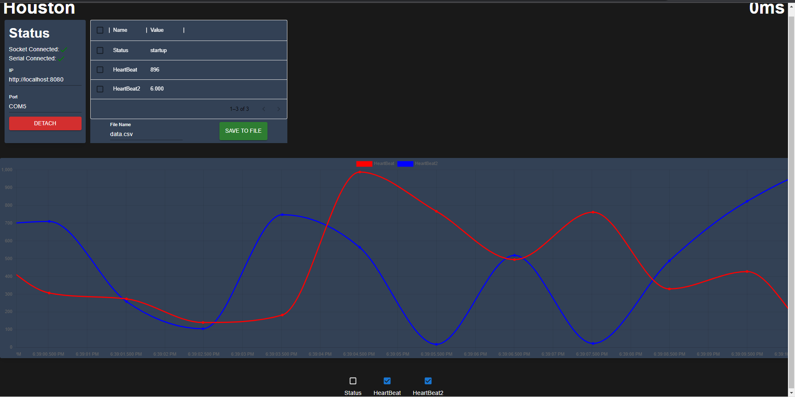

# Houston

Houston is a React based dashboard for monitoring Arduino boards during operation. I built it to monitor my university's
wind turbine, but it can be used for any Arduino board.



## ToDo (not necessarily in order)

* Cleaner UI
* ~~Live Graphs~~
* ~~Save Data to File~~
* Max,min,etc for variables
* Migrate to Typescript
* Configuring Variables Live
* Installation Guide

<!-- GETTING STARTED -->

## Getting Started

### Prerequisites

Please ensure you have the following installed

* NodeJS
* NPM
* Python3
* Pip

### Installation

1. Clone the repo
2. Move [Dashboard.h](Dashboard.h) into your Arduino project
3. Install NPM packages
   ```sh
   npm install
   ```
4. Install Python packages
   ```python
   pip install aiohttp python-socketio pyserial
   ```

<!-- USAGE EXAMPLES -->

## Usage

1. Send data from Arduino to the dashboard by including Dashboard.h and then
   ```c
   Dashboard::telemetry("Header", "Telemetry");
   ```
2. Then put the following at the end of everything
   ```c
   Dashboard::send();
   ```
3. Start the python server by doing
   ```python
   python Server.py
   ```
4. Start the dashboard by doing
   ```sh
   npm start
   ```
5. Change the port your Arduino is connected to and hit Attach
